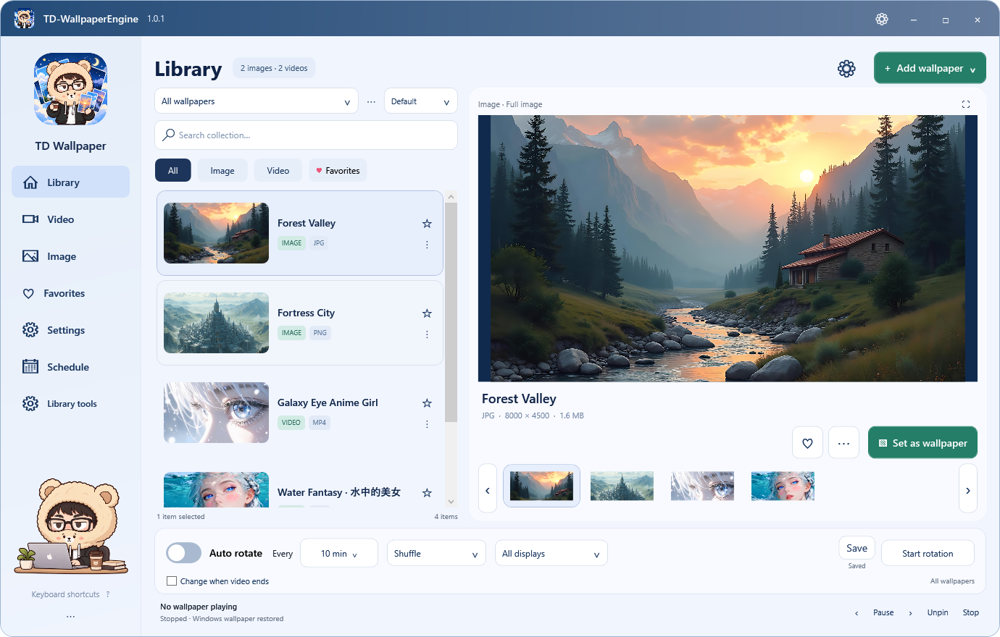
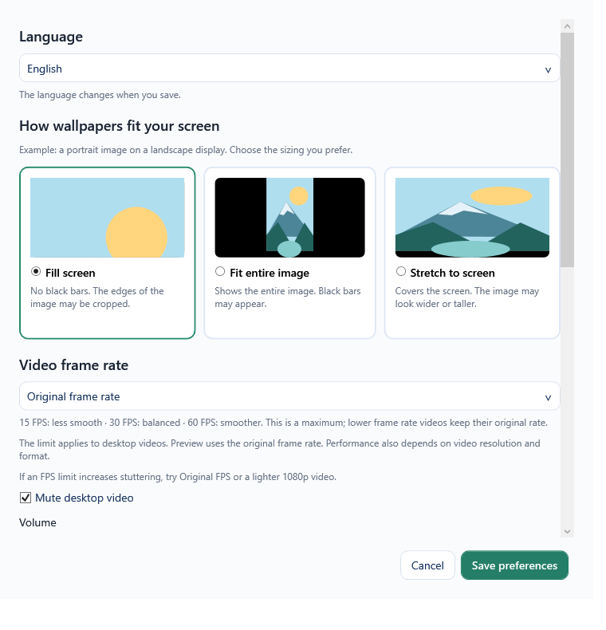

# TD-WallpaperEngine

A standalone Windows app for animated wallpapers, image collections and automatic rotation. English and Vietnamese. No Steam or Wallpaper Engine installation required.

[Download](https://github.com/tienDang0805/TD_WallpaperEngine/releases/latest) · [Changelog](CHANGELOG.md) · [Report an issue](https://github.com/tienDang0805/TD_WallpaperEngine/issues)



## Demo

Recorded on the owner's Windows desktop: using **Set as wallpaper** while the app stays open, followed by the actual desktop wallpaper change. The clip keeps the transition intact; it is not a window-only capture.


[Watch the 1080p desktop recording](https://github.com/tienDang0805/TD_WallpaperEngine/releases/download/v1.0.2/TD-WallpaperEngine-Demo.mp4).

## Main features

- Preview images and videos, including MP4 and WebM.
- Reuse the video renderer for smoother changes; hold the outgoing frame/preview thumbnail until the new video is ready.
- Import files/folders, or drag and drop into the library.
- Download direct media URLs and YouTube videos with progress, cancellation and automatic import.
- Collections, favorites, schedules and per-monitor rotation.
- Start shuffle with the selected wallpaper, then rotate without repeats within a round.
- Pause for fullscreen/maximized apps, battery use and application rules. Optional memory-saving mode releases the player.
- Original, 15, 30 or 60 FPS; hardware decoding when the GPU and codec support it.
- Missing-file checks, folder relinking, media backup, cleanup with undo and playback diagnostics.



## Download

Head to the [Releases page](https://github.com/tienDang0805/TD_WallpaperEngine/releases/latest) for the install wizard or portable ZIP.

| File | Use |
| --- | --- |
| TD-WallpaperEngine-1.0.2-Setup.exe | Per-user installer, shortcuts and uninstaller. |
| TD-WallpaperEngine-1.0.2-Portable.zip | Extract and run TienDang.Wallpaper.exe; keep accompanying files/folders. |
| Source code (zip) / Source code (tar.gz) | GitHub source snapshots for the release tag. |
| SHA256SUMS.txt | Checksums for the uploaded release files. |

The runnable application EXE is inside the portable ZIP and installed app folder. Its legacy filename preserves compatibility; the product name is TD-WallpaperEngine.

**Requirements:** Windows 10/11 x64, a Direct3D 11 GPU driver and space for the library. Downloads are self-contained: no separate .NET, mpv, yt-dlp, Deno or FFmpeg install is needed. Internet is needed for URL/YouTube downloads. Hardware decoding depends on the GPU and codec.

New libraries receive two supplied videos and two fantasy images. Existing and intentionally empty libraries are preserved.

## Quick start

1. Add wallpaper from your computer, a folder or URL.
2. Select it to preview.
3. Choose **Set as wallpaper**, or **Start rotation** for the collection.
4. Set interval, shuffle and target monitor.
5. Closing the window keeps playback in the tray; **Exit** ends the app.

Exit the old app from its tray menu before upgrading. Each display permits one desktop renderer; another instance can browse a separate library and preview.

Data stays in `%LOCALAPPDATA%/TienDangWallpaper`. Updates and uninstall preserve it. Launching the new app with the default library updates an already-enabled Windows startup entry. Startup launches wait 3 seconds; manual launches have no intentional delay.

Files imported without copying depend on their original locations. Enable copying for owned media, or use relinking after moving originals.

## Changelog

[Complete history](CHANGELOG.md) · [1.0.2 release notes](docs/RELEASE-1.0.2.md).

## Build from source

Windows x64 and the [.NET 10 SDK](https://dotnet.microsoft.com/download/dotnet/10.0) are required:

```powershell
./build.ps1 -Portable -OutputDirectory artifacts/release-1.0.2
```

Preparation scripts download pinned external tools and verify SHA256; the build runs core tests.

Git contains source, tests, scripts, necessary UI artwork and docs. Outputs, tool executables, samples, recordings, personal libraries and cookies are excluded.

Source builds can import your own media. To bundle the release samples, provide a four-file starter folder outside Git:

```powershell
./build.ps1 -Portable -StarterPackDirectory "D:/StarterPack"
./package-release.ps1 -Version 1.0.2 -Compiler "C:/Path/To/Inno Setup 6/ISCC.exe"
```

Packaging requires [Inno Setup 6](https://jrsoftware.org/isdl.php), the complete starter pack and matching source version. See [developer/release context](docs/DEVELOPMENT.md).

## License

Application source and docs: [MIT](LICENSE). Artwork, sample media and external executables retain their own rights/licenses; see [asset licenses](ASSET-LICENSES.md) and [starter credits](src/TienDang.App/StarterPack/CREDITS.md). Distribution packages include mpv/FFmpeg/yt-dlp/Deno and runtime notices.

## Tiếng Việt

Thêm ảnh/video hoặc kéo thả, chọn để xem trước rồi **Đặt làm nền**. Bật **Tự đổi nền** để chạy từ mục đang chọn và tiếp tục luân phiên. Bản mới giữ nguyên thư viện và setting cũ. Đóng cửa sổ sẽ thu app xuống khay hệ thống; chọn **Thoát** để dừng hẳn.

Hướng dẫn: [HUONG-DAN.txt](HUONG-DAN.txt). Video và ảnh mẫu có nguồn, giấy phép riêng.
